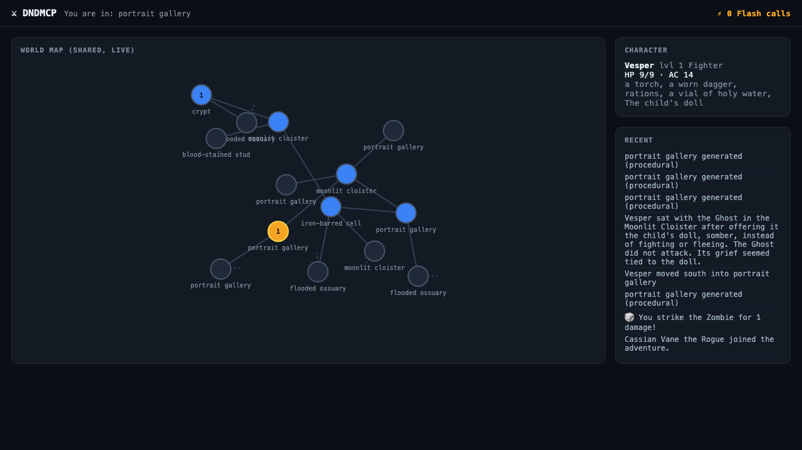

# DNDMCP — a persistent, multiplayer D&D world your agent runs as the DM

DNDMCP is an MCP server that turns any MCP-capable agent (Claude Code, Claude Desktop, etc.)
into a Dungeon Master for a real, shared, persistent tabletop campaign — no human DM, no
dice-app, no separate game client. Say "start an adventure" and your agent starts narrating,
rolling real dice, running combat, and writing everything that happens into a world that
survives across sessions and players.



## Play it right now

```bash
curl -fsSL https://raw.githubusercontent.com/zackmckennarunpod/dndmcp/main/scripts/install_claude_code.sh | bash
```

That points Claude Code at the live, pod-hosted shared world. Restart Claude Code (or run
`/mcp`), say **"start an adventure,"** and watch the world map update live in your browser.
Full instructions, Claude Desktop config, and self-hosting steps: **[`dndmcp/SETUP.md`](dndmcp/SETUP.md)**.

You're one of many ghosts passing through the same world — other players' kills, looted
items, and left notes show up as "traces of those who came before" when you enter a room.

## How it works

**The world is a graph, not a script.** Rooms, exits, NPCs, items, and quests are nodes and
edges in a SQLite-backed graph (`dndmcp/state.py`, `dndmcp/models.py`) that every player's
agent reads and writes through the same MCP tools. Nothing about the story is pre-written —
the map grows outward as players explore, and every change (a kill, a dropped item, a note)
persists for the next player who wanders through.

**Tools are mechanics, a persona is the DM.** DNDMCP exposes plain tools —
`start_adventure`, `look`, `move`, `attack`, `roll_dice`, `talk_to`, `start_quest`,
`get_state`, and more (full list: [`MCP_SURFACE.md`](MCP_SURFACE.md)) — plus one server
instruction that tells the connecting agent to *become* the Dungeon Master: narrate scenes,
call tools instead of inventing outcomes, and never fake a dice roll. The agent brings its
own model; DNDMCP brings the rules, the state, and the world.

**Two ways to play.** Anyone with an MCP client (Claude Code, Claude Desktop) connects
directly and their own agent plays live. For everyone else, the browser GUI runs its own
server-side DM agent loop (`dndmcp/dm_loop.py`) — a plain OpenAI-compatible tool-calling loop,
provider-agnostic — so you can play a full turn through a chat box with no agent of your own,
against the same shared world and the same rules engine.

**The GUI watches the agent play, live.** There's no special integration between "your agent"
and "the map" — every MCP tool call (`move`, `attack`, `roll_dice`, `talk_to`, ...) just writes
to the shared world DB, and the browser has no idea whether a human, an MCP agent, or the
server's own DM loop made that write. The world map re-polls the DB every 1.5s, so a room your
agent just walked into pops onto the graph a beat later with zero glue code. Separately, a
live SSE-pushed world-event stream (`GET /stream/events`) fans out every action from every
player's session to every open tab in real time — open the map, tell your agent to move or
fight something, and watch it show up.

**Rules are real, not vibes.** Monster stat blocks and conditions come from the vendored D&D
5e SRD (`dndmcp/srd/`, loaded by `dndmcp/compendium.py`), so combat and creature stats are
rules-accurate rather than model-hallucinated.

**GPU generation is optional, procedural fallback is the default.** New rooms, NPCs, items,
and dialogue can be generated live by an LLM running on a Runpod Flash serverless GPU
endpoint (`dndmcp/worldgen.py`, `dndmcp/flash_llm.py`, `dndmcp/inference.py`) — or, with no
Runpod account and zero config, DNDMCP falls back to a deterministic procedural content pool
and the game works exactly the same. Scene art can similarly be GPU-generated (SDXL-Turbo)
and rendered as ANSI art in-terminal (`dndmcp/flash_art.py`, `dndmcp/art.py`).

## Tech stack

| Layer | What |
|---|---|
| **Protocol** | [MCP](https://modelcontextprotocol.io) via [FastMCP](https://github.com/jlowin/fastmcp) (stdio and streamable-HTTP transports) |
| **Server / GUI** | FastAPI + Uvicorn; map polls the shared DB every 1.5s, chat and the world-event feed are pushed live over SSE |
| **State** | SQLite (world graph, campaigns, players, quests), Pydantic models over it |
| **Rules** | Vendored D&D 5e SRD data (monsters, conditions) |
| **GPU generation (optional)** | [Runpod Flash](https://runpod.io) — serverless vLLM for text/NPC generation, SDXL-Turbo for art |
| **Browser play** | A provider-agnostic OpenAI-chat-completions tool-calling loop, no vendor SDK |
| **Deploy** | Docker image (`zackmckennarunpod/dndmcp`), runs on a Runpod CPU pod with a network volume for persistence |

## Repo layout

| Path | What |
|---|---|
| `dndmcp/` | The product. MCP server + game engine + web GUI + world generation — see below |
| `dndmcp/SETUP.md` | Install & play — shared world, local dev, self-hosting |
| `dndmcp/CLAUDE.md` | Operating the live pod (deploy, redeploy, debugging) |
| `MCP_SURFACE.md` | Full tool/skill/resource surface, shipped vs. planned |
| `WORLD_SCHEMA.md` | The world-graph data model and design principles |
| `dndmcp/GENERATION_FEATURES.md`, `dndmcp/MULTIWORLD_DESIGN.md` | In-progress feature specs |
| `Dockerfile` | The deployable brain image (MCP + GUI together) |
| `scripts/` | Deploy/redeploy/status/logs/teardown for the live and self-hosted pods |
| `forge/` | The underlying GPU toolkit DNDMCP is built on — mint a Flash GPU endpoint, call it, tear it down, at runtime. Usable standalone; see `forge/`'s own docstrings and `.claude/skills/forge/` |
| `research/`, `STRATEGY.md`, `JUDGING.md`, `KNOWLEDGE.md` | Background from this project's origin as a Runpod Flash hackathon entry |

## Self-hosting

You don't need the live pod above — the image is public and needs no baked-in secrets, just
your own Runpod API key:

```bash
RUNPOD_API_KEY=... scripts/deploy_own_pod.sh [name] [datacenter]   # creates volume + pod
scripts/install_claude_code.sh <pod-id>                            # connect Claude Code to it
scripts/destroy_own_pod.sh <pod-id> --yes                          # tear it down when done
```

This gets you a completely independent world. Full details, costs, and env vars in
[`dndmcp/SETUP.md`](dndmcp/SETUP.md).

## License

MIT — see [`LICENSE`](LICENSE). D&D SRD content under `dndmcp/srd/` is Open Game Content.
